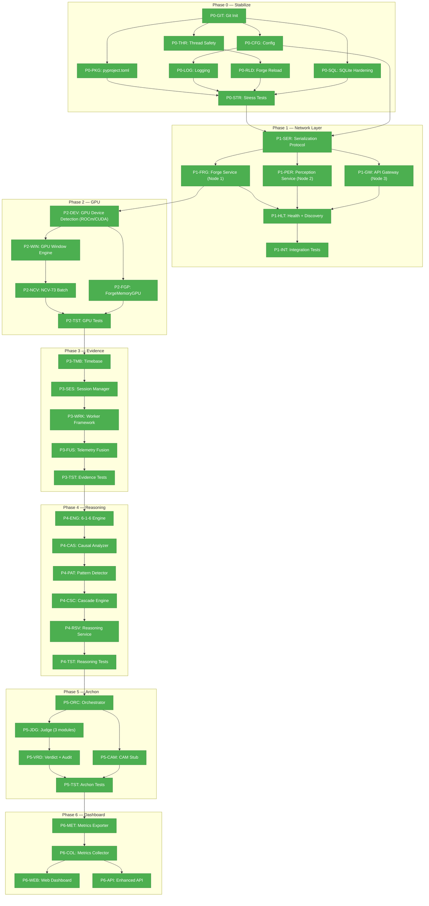

# Wolf Engine — Build Tracking (LAW v1.0)

## Master Flowchart

---

## Test Matrix

| Phase | Test File | Tests | Status |
|-------|-----------|-------|--------|
| 0 | `tests/test_acceptance.py` | 6 acceptance | 6/6 PASS |
| 0 | `tests/test_stress.py` | 6 stress | 6/6 PASS |
| 1 | `tests/test_services.py` | 11 integration | 11/11 PASS |
| 2 | `tests/test_gpu.py` | 31 GPU (30 pass, 1 skip) | 31/31 PASS |
| 3 | `tests/test_evidence.py` | 26 evidence | 26/26 PASS |
| 4 | `tests/test_reasoning.py` | 30 reasoning | 30/30 PASS |
| 5 | `tests/test_archon.py` | 38 archon | 38/38 PASS |
| 6 | `tests/test_dashboard.py` | 42 dashboard (41 pass, 1 skip) | 42/42 PASS |

**Run all:** `python -m pytest tests/ -v`

---

## Build Log

| Commit | Hash | Tests | Nodes Completed |
|--------|------|-------|-----------------|
| Phase 0 baseline | `a3d4e34` | 6/6 | P0-GIT |
| Phase 0 complete | `97ae2f5` | 12/12 | P0-PKG, P0-CFG, P0-LOG, P0-THR, P0-SQL, P0-RLD, P0-STR |
| Tracking doc | `0eefa9c` | 12/12 | — |
| Phase 1 complete | `4682ccc` | 23/23 | P1-SER, P1-FRG, P1-PER, P1-GW, P1-HLT, P1-INT |
| Phase 2 complete | `e010b75` | 54/54 | P2-DEV, P2-WIN, P2-FGP, P2-NCV, P2-TST |
| Phase 3 complete | `e86568e` | 80/80 | P3-TMB, P3-SES, P3-WRK, P3-FUS, P3-TST |
| Phase 4 complete | `639b44d` | 110/110 | P4-ENG, P4-CAS, P4-PAT, P4-CSC, P4-RSV, P4-TST |
| Phase 5 complete | `7fff9b8` | 148/148 | P5-ORC, P5-JDG, P5-VRD, P5-CAM, P5-TST |
| Phase 6 complete | `16573a5` | 190/190 | P6-MET, P6-COL, P6-WEB, P6-API |

---

## Node Detail Index

### Phase 0 (COMPLETE)

| NodeID | Status | File(s) Modified | Exit Criteria Met |
|--------|--------|-----------------|-------------------|
| P0-GIT | NORMAL | `.gitignore` | git log shows baseline commit |
| P0-PKG | NORMAL | `pyproject.toml` | pytest picks up configfile |
| P0-CFG | NORMAL | `config.py`, `gnome/config.py` | env vars override defaults |
| P0-LOG | NORMAL | `logging_config.py` | JSON output with timestamp/level/module/message |
| P0-THR | NORMAL | `forge/forge_memory.py` | RLock on all methods, concurrent test passes |
| P0-SQL | NORMAL | `sql/sqlite_writer.py`, `sql/sqlite_reader.py` | check_same_thread, batch write, disk check |
| P0-RLD | NORMAL | `forge/forge_memory.py` | reload_from_events() works, Test 5 uses it |
| P0-STR | NORMAL | `tests/test_stress.py` | 6 stress tests all pass |

### Phase 1 (COMPLETE)

| NodeID | Status | File(s) | Exit Criteria Met |
|--------|--------|---------|-------------------|
| P1-SER | NORMAL | `services/protocol.py` | JSON encode/decode round-trips, contract serialization |
| P1-FRG | NORMAL | `services/forge_service.py` | ZMQ REP, ingest/query/stats/health all tested |
| P1-PER | NORMAL | `services/perception_service.py` | Tokenize + 6-1-6 context windows verified |
| P1-GW | NORMAL | `services/gateway.py` | Flask /think, /query, /stats, /health all tested |
| P1-HLT | NORMAL | `services/health.py`, `cluster_config.json` | Health monitor detects DOWN after miss_threshold |
| P1-INT | NORMAL | `tests/test_services.py` | 11/11 tests: protocol, perception, forge, gateway, health, degradation |

### Phase 2 (COMPLETE)

| NodeID | Status | File(s) | Exit Criteria Met |
|--------|--------|---------|-------------------|
| P2-DEV | NORMAL | `gpu/device.py` | GPU auto-detect (ROCm/CUDA), fail-hard (no CPU), DeviceInfo, to_tensor |
| P2-WIN | NORMAL | `gpu/window_engine.py` | GPU torch.unique co-occurrence, CPU fallback, parity verified |
| P2-FGP | NORMAL | `gpu/forge_memory_gpu.py` | GPU resonance tensor (ROCm/CUDA), batch_ingest scatter_add_, topk, sparse co-occurrence |
| P2-NCV | NORMAL | `gpu/ncv_batch.py` | 73-dim vector generation, CPU single + GPU batch, domain-agnostic |
| P2-TST | NORMAL | `tests/test_gpu.py` | 31 tests (8 device, 6 window, 10 forge-gpu, 8 ncv), GPU/CPU parity |

### Phase 3 (COMPLETE)

| NodeID | Status | File(s) | Exit Criteria Met |
|--------|--------|---------|-------------------|
| P3-TMB | NORMAL | `evidence/timebase.py` | Dual-clock Timestamp, EvidenceEvent, ordering, round-trip |
| P3-SES | NORMAL | `evidence/session_manager.py` | Session dirs + manifests, worker registration, list/stop lifecycle |
| P3-WRK | NORMAL | `evidence/worker_base.py`, `evidence/workers.py` | WorkerBase ABC, write_safe(), 4 concrete workers (perf/network/process/input) |
| P3-FUS | NORMAL | `evidence/fusion.py` | Multi-worker JSONL merge sorted by timestamp, FusionWatcher, skip malformed |
| P3-TST | NORMAL | `tests/test_evidence.py` | 26 tests (4 timebase, 1 event, 8 session, 2 write_safe, 2 worker, 3 concrete, 6 fusion) |

### Phase 4 (COMPLETE)

| NodeID | Status | File(s) | Exit Criteria Met |
|--------|--------|---------|-------------------|
| P4-ENG | NORMAL | `reasoning/engine.py` | Two-pass 6-1-6 streaming, lifetime counts, windows, resonance |
| P4-CAS | NORMAL | `reasoning/causal_analyzer.py` | Bidirectional validation via ForgeMemory co-occurrence |
| P4-PAT | NORMAL | `reasoning/pattern_detector.py` | Pattern breaks (z-score), causal chains (run-length), anomalies |
| P4-CSC | NORMAL | `reasoning/cascade_engine.py` | BFS on co-occurrence graph, forward/backward, depth/node caps |
| P4-RSV | NORMAL | `reasoning/reasoning_service.py` | ZMQ REP :5002, analyze/detect/cascade/windows/health |
| P4-TST | NORMAL | `tests/test_reasoning.py` | 30 tests (7 engine, 4 causal, 5 pattern, 7 cascade, 7 service) |

### Phase 5 (COMPLETE)

| NodeID | Status | File(s) | Exit Criteria Met |
|--------|--------|---------|-------------------|
| P5-ORC | NORMAL | `archon/orchestrator.py` | End-to-end governed analysis, wires Engine → Judge → Audit |
| P5-JDG | NORMAL | `archon/judge.py` | 3 modules: Confidence Governance, Temporal Coherence, Citadel Isolation |
| P5-VRD | NORMAL | `archon/verdict.py`, `archon/schemas.py` | SQLite audit trail, NaN sanitization, query by session/status |
| P5-CAM | NORMAL | `archon/cam_stub.py` | Dormant interface, activates on register_engine(), multi-engine comparison ready |
| P5-TST | NORMAL | `tests/test_archon.py` | 38 tests (3 schema, 7 citadel, 4 confidence, 4 temporal, 5 judge, 4 verdict, 5 CAM, 6 orchestrator) |

### Phase 6 (COMPLETE)

| NodeID | Status | File(s) | Exit Criteria Met |
|--------|--------|---------|-------------------|
| P6-MET | NORMAL | `dashboard/metrics_exporter.py` | ZMQ PUB per node, CPU/RAM/GPU/Forge/Archon metrics, JSON-serializable snapshots |
| P6-COL | NORMAL | `dashboard/metrics_collector.py` | ZMQ SUB → SQLite, in-memory latest cache, time-series history, 7-day auto-prune |
| P6-WEB | NORMAL | `dashboard/web.py` | Dark-theme HTML (Flask + SSE + Chart.js CDN), 7 panels, real-time updates |
| P6-API | NORMAL | `dashboard/app.py` | Unified app: /dashboard, /api/metrics, /api/verdicts, /api/sessions, /api/stream SSE, /health |

---

## Hallucination Ledger

| ID | Category | Claim | Status |
|----|----------|-------|--------|
| H-1 | Ghost API | `ForgeMemory.reload_from_events()` | RESOLVED — built in Phase 0 |
| H-2 | Ghost File | `wolf_engine/config.py` | RESOLVED — built in Phase 0 |
| H-3 | Ghost File | `wolf_engine/logging_config.py` | RESOLVED — built in Phase 0 |
| H-4 | Ghost File | `wolf_engine/tests/test_stress.py` | RESOLVED — built in Phase 0 |
| H-5 | Ghost File | `pyproject.toml` | RESOLVED — built in Phase 0 |
| H-6 | Unproven | "~100 writes/sec single-insert SQLite" | UNKNOWN — not benchmarked |
| H-7 | Unproven | "RLock overhead ~2-5%" | UNKNOWN — not measured on Py3.14 |
| H-8 | Hidden Dep | `shutil.disk_usage()` on OneDrive paths | UNKNOWN — works on local, untested on network |

---

## Environment

- **Python:** 3.14.3
- **pytest:** 9.0.2
- **OS:** Windows 11 Pro
- **Shell:** bash (Unix syntax)
- **torch:** >=2.4.0+rocm7.1 (ROCm 7.1, AMD RX 7900 XT 20GB VRAM)
- **Git:** Local only (no remote)
